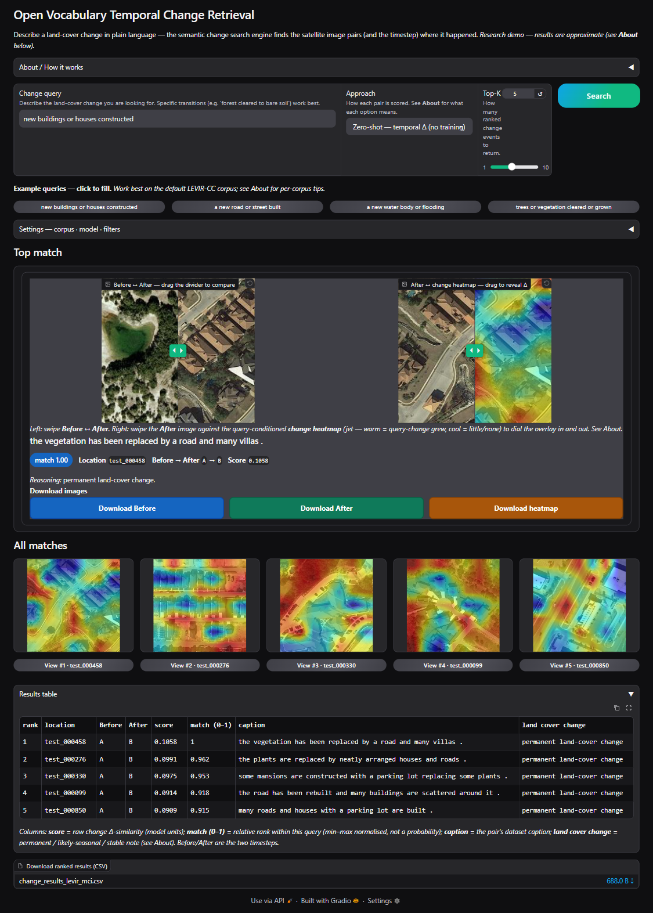

# Open Vocabulary Temporal Change Retrieval (GBDA Lab Project)

> **Results → [Results at a glance](#results-at-a-glance) below; full report → [`report/main.pdf`](report/main.pdf)** (headline as submitted: GeoRSCLIP+NRG `patch_top3`, CV mAP 0.193 ± 0.051, 4/9 FDR-significant; recomputed with the corrected Dynamic EarthNet class names and patch tokens, 0.184 ± 0.046 and 6/8, against a fold-level random floor of about 0.12 — read the report with the [notes on the report](#notes-on-the-report)).

A *Semantic Change Search Engine*: given a natural-language query
(e.g. *"new buildings on former agricultural land"*, *"forest cleared to bare
soil"*), retrieve the satellite image **pairs and the timestep** where that
change occurred — across a multitemporal dataset, without training a
class-specific detector.

Frozen vision-language backbones (CLIP / GeoRSCLIP / RemoteCLIP) encode each
timestep; a bi-temporal *change feature* is matched against the query text.
Primary dataset: **Dynamic EarthNet (DEN)**; the dataset-agnostic registry also
runs **QFabric** (construction change-types), **LEVIR-CC/MCI** (human-captioned
building/road change + masks) and **SECOND-CC** (a six-class land-cover open
vocabulary + semantic masks), with LEVIR-MCI and SECOND-CC masks driving
quantitative change localisation.

> **Just want to run the app?** Jump to [Run / install / use](#run--install--use) —
> install, then a 30-second synthetic demo or the real dataset.

## Demo

**Try it live:** the current UI runs over a bundled synthetic corpus, no install, on the
[deployed HuggingFace Space](https://huggingface.co/spaces/panagiotis427/Open_Vocabulary_Temporal_Change_Retrieval).



**Screen recordings** (`demos/`, click to play on GitHub) —
[1](demos/demo_1.mp4) · [2](demos/demo_2.mp4) · [3](demos/demo_3.mp4) the app in default settings
(LEVIR-MCI — the documented default, sharing LEVIR-CC's pairs — GeoRSCLIP, zero-shot) running the built-in example searches;
[4](demos/demo_4.mp4) a custom free-text query (open-vocabulary);
[5](demos/demo_5.mp4) switching dataset (LEVIR-MCI → Dynamic EarthNet) and scoring approach
(zero-shot → patch / localised). The recordings predate the patch-token correction, so their
GeoRSCLIP heatmaps are the uncorrected ones ([note 2](#2-patch-level-results-of-georsclip-and-remoteclip)).

*Enter a free-text change query, pick a dataset / encoder / scoring approach, and get
ranked before→after pairs with a change heatmap on T2.* The screenshot is the app on its
default corpus (`python -m src.app`, the first example query), which needs LEVIR-MCI under
`data/_levir_mci/extracted/LEVIR-MCI-dataset`; the bundled fixture runs the same UI with no
download, as the Space does:

```bash
pip install -e .
python -m scripts.make_den_fixture
python -m src.app --dataset dynamic_earthnet --root tests/fixtures/den_tiny --split all --encoder clip_vitl14   # http://127.0.0.1:7860
```

## Pipeline

End-to-end flow for one user query, with the module responsible at each
step:

```
┌─ offline (one-time per dataset+encoder, cached) ─────────────────────────┐
│                                                                          │
│  TemporalDataset.list_pairs()                src/datasets/*               │
│           │                                                               │
│           ▼                                                               │
│  load_pair_images(pair)  ──▶  PIL T1, T2                                  │
│           │                                                               │
│           ▼                                                               │
│  ImageTextEncoder.encode_image     src/encoders/*  (CLIP / GeoRS /        │
│           │                                          RemoteCLIP, frozen)  │
│           ▼                                                               │
│  f_T1, f_T2  (L2-normed, [N, D])  ──cache──▶                              │
│   data/cache/<dataset>__<encoder>__<split>[_<color>][_lora]__pair_embeddings.npz │
│                                       src/embeddings.py                   │
└──────────────────────────────────────────────────────────────────────────┘

┌─ adapter training (only for `peft` approach; offline) ───────────────────┐
│                                                                          │
│  weak caption per pair  ──ProjectionHead──▶  masked symm. InfoNCE         │
│  (e.g. "forest replaced by soil")                                        │
│                                              src/train.py                 │
│  → models/<dataset>__<encoder>__adapter.pt                                │
└──────────────────────────────────────────────────────────────────────────┘

┌─ inference (per query, hot path) ────────────────────────────────────────┐
│                                                                          │
│  user query text  ─encoder.encode_text─▶  t  (same shared [D] space)     │
│                                                                          │
│       ┌───────────────── ChangeRetriever.score_all ──────────────────┐    │
│       │   naive      :  t · f_T2                                     │    │
│       │   zero_shot  :  t · f_T2  −  t · f_T1   (Δ-similarity)       │    │
│       │   peft       :  t · g(Δf)   with Δf = f_T2 − f_T1            │    │
│       └────────────────────────────────────────────────────────────┘    │
│                              src/retrieval.py                            │
│                                    │                                     │
│                                    ▼                                     │
│  rank all pairs by score  ──▶  top-K change events                       │
│                                    │                                     │
│                                    ▼                                     │
│  for top-1: dataset.load_pair_images(pair)  +                            │
│  encoder.compute_patch_text_similarity → heatmap on T2                   │
│                                              src/app.py + src/heatmap.py │
│                                                                          │
│  label-grounded benchmark (offline, optional)                            │
│  per-query relevance from PairLabel → Recall@K, mAP, seasonal drift      │
│                                              src/benchmark.py            │
└──────────────────────────────────────────────────────────────────────────┘
```

Three scoring **approaches** (the supervisor-requested comparison):

| Approach    | Score                                       | Training |
|-------------|---------------------------------------------|----------|
| `naive`     | cos(t, f_T2)                                | none (lower bound) |
| `zero_shot` | cos(t, f_T2) − cos(t, f_T1)  (Δ-similarity) | none |
| `peft`      | cos(t, g(Δf)), g = trained ProjectionHead   | ~0.5–0.7 M params (adapter only; backbones frozen) |

*Per-encoder results for all three approaches — in-distribution and cross-split — are in the report ([`report/main.pdf`](report/main.pdf), §8.2).*

**Key decoupling:** `f_T1, f_T2` are cached per `(dataset, encoder, split, color_mode)` so all
three approaches and any number of queries reuse the same one-time encode
pass. Adding a dataset = implementing the `TemporalDataset` protocol +
registering — the entire flow above re-uses the new dataset unchanged
(see [Extending](#extending) below).

**Evaluation** is label-grounded: a fixed query set (per dataset, under
`src/queries/<name>.py`) maps each query to a relevance rule over the
derived `PairLabel`s → Recall@K, mAP, plus a seasonal-vs-permanent
("semantic drift") error report.

## Results at a glance

Frozen vision-language change retrieval reaches about **0.2 cross-validated mAP** on Dynamic
EarthNet. The report's headline configuration, **GeoRSCLIP + NRG with patch-level top-3 Δ-scoring, scores
CV mAP 0.193 ± 0.051** (4/9 queries FDR-significant; 0.195 ± 0.048 and 5/9 when the query is averaged
over a prompt ensemble, within noise). The report's Dynamic EarthNet class names are one class off and
its GeoRSCLIP and RemoteCLIP patch tokens lacked attention between patches; recomputed with both
corrections, the headline is **0.184 ± 0.046** over 8 evaluable queries (6/8 FDR-significant), against a
fold-level random floor of about 0.12 (see the [notes on the report](#notes-on-the-report)). Open-vocabulary
breadth holds on LEVIR-CC / SECOND-CC (building and road change strong; vegetation, demolition and water
change weak); LoRA adapters memorise the training AOIs and collapse on held-out ones, and the
cross-validated PEFT head is not significantly above frozen zero-shot (0.196 ± 0.049 against 0.139 ± 0.024
as submitted, higher in 4 of 5 folds; 0.207 ± 0.079 against 0.142 ± 0.039 corrected, higher in 3 of 5), so
it ties the frozen headline rather than beating it; heatmap localisation is at best a weak signal. Numbers
are reported against random-ranking baselines, with permutation tests (pair-level permutations), BH-FDR
and 5-fold cross-validation grouped by AOI.

**Full results** — per-encoder tables, the honest single-split→CV arc, every ablation, and all
figures — **are in the deliverable report: [`report/main.pdf`](report/main.pdf).**

## Module map

| File | Role |
|------|------|
| `src/datasets/` | `TemporalDataset` protocol, `DENDataset` (raster), `DENNpyDataset` (DynNet `.npy` + `color_mode` rgb/nrg/ndvi via NIR infrared frames), `TEOChatlasQFabricDataset` (`qfabric_teo` — QFabric crops + RQA2 change-type labels), `StatusQFabricDataset` (`qfabric_status` — RQA5 status transitions), `LevirCCDataset` (`levir_cc` — building-change pairs + human captions), `LevirMCIDataset` (`levir_mci` — LEVIR-CC + building/road change masks), `SecondCCDataset` (`second_cc` — captioned six-class land-cover change + per-phase semantic masks), `DENPlanetDataset` (`dynamic_earthnet_planet` — native 3 m Planet-Fusion surface-reflectance rasters), layout-detecting registry + opts adapters |
| `src/queries/` | Per-dataset query sets (`den.py`, `qfabric.py`, `qfabric_status.py`, `levir_cc.py`, `levir_mci.py`, `second_cc.py`); registry resolved by `dataset.name` |
| `src/results_io.py` | serialize `BenchmarkReport` to JSON/CSV (torch-free); consumed by the figure scripts |
| `src/error_analysis.py` | per-query confusion matrix + precision/recall (seasonal-vs-permanent error analysis) |
| `src/encoders/` | `ImageTextEncoder` protocol; `clip_vitl14` (768-d), `georsclip` (512-d), `remoteclip` (768-d) |
| `src/text_encoder.py` | frozen CLIP text tower (`text_model` + `text_projection`, device-aware) |
| `src/features.py` | `compute_change_feature` (difference / concatenate) |
| `src/embeddings.py` | per-pair `f_T1,f_T2` compute + npz cache (`PairEmbeddingStore`); `cache_tag` arg keys cache by split+color to prevent cross-split collision |
| `src/retrieval.py` | `ChangeRetriever` — naive / zero_shot / peft scoring |
| `src/benchmark.py` | query set + label relevance, Recall@K / mAP / drift |
| `src/model.py` | `ProjectionHead` adapter, InfoNCE, adapter save/load |
| `src/train.py` | PEFT training (masked symmetric InfoNCE on weak captions) |
| `src/lora_train.py` | LoRA fine-tuning of visual encoder via peft; `train_lora`, `merge_lora_into_encoder`, `save_lora` |
| `src/geo_filter.py` | `GeoFilter` — filter pairs by continental region or lat/lon bbox using `aoi_metadata.json`; toggleable |
| `src/rerank.py` | `Reranker` — post-retrieval re-ranking: `diversity` (unique AOIs) or `coherence` (cluster near top-1); toggleable |
| `src/app.py` | Gradio engine + UI (Dataset / Encoder / Approach selectors) |
| `app.py` | HuggingFace Spaces entry point (uses tiny fixture by default; override via env vars) |
| `scripts/download_den.py` | fetch + extract DEN subset, build label index |
| `scripts/build_qfabric_labels.py` | TEOChatlas RQA2 → `qfabric_teo_labels.json` (27,879 real crop→change-type labels) |
| `scripts/build_qfabric_status_labels.py` | TEOChatlas RQA5 → `qfabric_status_labels.json` (per-timepoint construction-status labels) |
| `scripts/eval_rerank.py` | re-ranking benchmark (diversity / coherence) on the DEN test split (report Appendix C) |
| `scripts/make_cv_figure.py` | CV-progression figure (single-split → full-corpus → 5-fold) from `results/` (report §8.1) |
| `scripts/run_seasonal_gate.py` | seasonal false-positive gate / stable-pair FPR robustness check |
| `scripts/benchmark_qfabric.py` | extract QFabric crops + encode + label-grounded change-type mAP (`qfabric_teo`) |
| `scripts/benchmark_levir_cc.py` | LEVIR-CC 5-query open-vocab retrieval, per-query AP (reads the shared LEVIR-MCI dir) |
| `scripts/benchmark_second_cc.py` | SECOND-CC 7-query open-vocab breadth retrieval, per-query AP |
| `scripts/eval_localization.py` | quantitative change localisation (pointing-game + patch-AP vs mask) — `--dataset levir_mci\|second_cc` |
| `scripts/peft_augment_eval.py` | anti-memorization check: frozen / PEFT / PEFT+feature-noise on the same leakage-free folds (exploratory; not surfaced in the report) |
| `scripts/make_den_fixture.py` | tiny synthetic DEN tree for fast tests |
| `scripts/run_pipeline.py` | one-command run with `--train-split` / `--eval-splits` / `--color-mode` / `--mode` / `--lora` / `--results-dir`; cross-split mAP table |
| `scripts/precompute_patch_embeddings.py` | warm the on-disk per-patch embedding cache (`PatchEmbeddingStore` in `src/embeddings.py`) so the first `approach="patch"` query in the app is instant instead of a full GPU pass |
| `scripts/export_results.py` | regenerate benchmarks from cache → `results/*.json` + `macro_summary.csv` (`--confusion` for error analysis) |
| `scripts/make_figures.py` | publication PNGs (recall curves, mAP bars, colour heatmap, seasonal drift, cross-split, confusion) from `results/` |
| `scripts/make_comparison_figure.py` | static zero-shot-vs-PEFT top-K visual comparison per encoder |
| `scripts/make_qualitative_figure.py` | qualitative salient-vs-subtle retrieval figure — actual top-1 pair per query as [Before \| After \| change heatmap], relevance from the query predicate (honest, non-cherry-picked; heatmap shown as a weak localiser, report §8.5) |
| `scripts/lora_sweep.py` | LoRA rank/epoch sweep (georsclip+nrg), in-memory, no cache/model clobber |
| `scripts/significance_audit.py` | random-ranking baseline + permutation p + BH-FDR over every result cell → `results/results_audit_summary.csv` (report §7 protocol, applied across §8) |
| `scripts/cv_eval.py` | full-corpus + k-fold AOI cross-validation with bootstrap CIs; `--relevance fraction` swaps dominant-class-flip relevance for pixel-fraction (report §8.1); merges cached split embeddings, no re-encode |
| `scripts/patch_eval.py` | patch-level (localised) Δ-similarity change retrieval vs the global baseline (report §8.1, "S3"); caches per-patch embeddings via `encoder.encode_image_patches`. `--approach hybrid` fuses global+patch, `patch_softattn`/`patch_spatial` are training-free change-attention variants, `--prompt-ensemble` averages query templates (all report §8.3) |

*Native-3m experiment scripts — `download_den_planet`, `make_jpeg_ablation_figure`, `make_temporal_pinpoint_figure` — are documented in [`feature_3m_native/README.md`](feature_3m_native/README.md); `make_dataset_figures` and `make_pipeline_figure` generate report figures from `results/`; `scripts/deploy_space.py` publishes the HuggingFace Space.*

## Run / install / use

**Requirements:** Python 3.12+ · ~3 GB disk (model weights) · ~9 GB more for real DEN · GPU optional.
RS-encoder weights download from HuggingFace on first use into `.model_cache/`. On-disk DEN
layouts (`planet/*.tif` raster or DynNet preprocessed `.npy`) are auto-detected; dataset sources
in [Datasets & model resources](#datasets--model-resources) below.

### 1. Setup (one-time)

```bash
git clone https://github.com/Panagiotis427/msc-gbda-ov-temporal-change-retrieval.git && cd msc-gbda-ov-temporal-change-retrieval

python -m venv .venv
source .venv/bin/activate          # Windows (PowerShell): .venv\Scripts\Activate.ps1
                                   #   if blocked once: Set-ExecutionPolicy -Scope CurrentUser RemoteSigned

pip install -e .
```

### 2. Option A — 30-second synthetic demo (no download)

```bash
python -m scripts.make_den_fixture
# Builds tests/fixtures/den_tiny/: 2 AOIs × 8 months, <1 MB, deterministic.

python -m src.app --dataset dynamic_earthnet --root tests/fixtures/den_tiny --split all --encoder clip_vitl14
# First run downloads CLIP weights (~1.6 GB) into .model_cache/ — one-time.
# Open http://127.0.0.1:7860
```

### 2. Option B — real Dynamic EarthNet (~7 GB)

```bash
python -m scripts.download_den --dest data/DynamicEarthNet
# ~7 GB ZIP via gdown; extracted; idempotent (_done.marker guards re-runs).

python -m src.app --dataset dynamic_earthnet --root data/DynamicEarthNet --encoder clip_vitl14
# DEN's launch profile supplies split/colour; --approach defaults to zero_shot.
# Switch to --approach peft (or patch) in the UI for the other scorings.
```

### App usage

Type a free-text change query (or click a curated example) and press **Search**. The top match opens
in a detail panel with two swipe sliders — before against after, and after against the
query-conditioned change heatmap — beside its match score and a seasonal-vs-permanent note, with
buttons to download the before, after, and heatmap images. The match score is the raw retrieval
score (a difference of cosine similarities) min–max normalised across the returned results: a
relative ranking within the query, not a calibrated probability. The remaining matches fill a thumbnail
grid whose per-tile **View** button promotes any result into the detail panel, and a ranked table
(exportable to CSV) lists them all. A collapsible **Settings** panel chooses the dataset, encoder,
colour mode, PEFT/LoRA, and the optional geographic filter and re-ranking, applied on **Apply** —
for that browser session only, so visitors to a shared deployment do not change each other's corpus; a
collapsible **About** panel explains each scoring approach and the honest accuracy expectations.
Startup defaults are set through CLI flags:

| Flag | Default | Notes |
|---|---|---|
| `--dataset` | `levir_mci` | Corpus to load (must have a query set + launch profile). |
| `--encoder` | `georsclip` | `clip_vitl14` / `georsclip` / `remoteclip`. |
| `--approach` | `zero_shot` | `naive` / `zero_shot` / `patch` / `peft` (switchable in the UI). |
| `--root` | dataset profile | Dataset dir; defaults to the selected dataset's launch-profile root. |
| `--split` | dataset profile | `train`/`val`/`test`/`all`; defaults to the dataset's profile split. |
| `--color-mode` | dataset profile | `rgb`/`nrg`/`ndvi`; DEN profile defaults to `nrg`, other corpora to `rgb`. |
| `--pairing` | `bimonthly` | How DEN's 24 monthly timesteps pair into (T1, T2). |
| `--host` | `127.0.0.1` | Bind address; `0.0.0.0` exposes on the LAN (auto-selected on a HF Space). |
| `--port` | `7860` | Gradio HTTP port (in use? add `--port 7861`). |
| `--lora` / `--no-lora` | off | Load LoRA-adapted embeddings (pre-cache via `run_pipeline --lora`). |
| `--geo-filter` / `--no-geo-filter` | off | Geographic region filter. |
| `--rerank` / `--no-rerank` | off | Post-retrieval re-ranking. |
| `--rerank-strategy` | `diversity` | `diversity` = unique locations; `coherence` = cluster near top-1. |

> `peft` errors "no adapter" → adapter missing from `models/`; train with `run_pipeline` (below)
> or switch to `zero_shot`. **Hosted demo (no install):** the app is live on the
> [HuggingFace Space](https://huggingface.co/spaces/panagiotis427/Open_Vocabulary_Temporal_Change_Retrieval);
> redeploy the current tree with `python scripts/deploy_space.py`.

### Developer — pipeline, training, tests

```bash
# Full pipeline: train on train split, evaluate on all three splits
python -m scripts.run_pipeline --root data/DynamicEarthNet \
    --encoder clip_vitl14 --train-split train --eval-splits train val test --epochs 40

# Best zero-shot generalisation (GeoRSCLIP + NIR, no training)
python -m scripts.run_pipeline --root data/DynamicEarthNet \
    --encoder georsclip --color-mode nrg --eval-splits train val test --skip-train

# LoRA adapter on the visual encoder
python -m scripts.run_pipeline --root data/DynamicEarthNet \
    --encoder georsclip --color-mode nrg --skip-train \
    --lora --lora-epochs 20 --lora-rank 4 --lora-alpha 8 --eval-splits train val test
```

Repeat with `--encoder georsclip` / `remoteclip` for the three-encoder comparison in the report
([`report/main.pdf`](report/main.pdf), §8.2). `run_pipeline` is the canonical, cache-consistent flow; the
individual stages (`src.embeddings`, `src.benchmark`, `src.train`, `src.lora_train`) are
convenience entry points — pass the same `--split` / `--color-mode` to every stage so they
share the split-tagged embedding cache.

```bash
pytest -q                              # full suite (test_text_encoder needs the real CLIP weights — network or a warm cache — and skips without them)
pytest -q --ignore=tests/test_text_encoder.py   # fast CPU loop, about 2 min on a laptop CPU (mock encoders, synthetic fixture)
```

## Dependencies — `pyproject.toml` vs `requirements.txt`

Two dependency files, two purposes:

- **`pyproject.toml`** — the full development install (`pip install -e .`). It is the source of
  truth for local work: the runtime stack **plus** the test/figure/data extras the app itself
  never imports (`pytest`, `coverage`, `matplotlib` for the report figures, `gdown` for dataset
  download) and `opencv-python`. `pip` ignores the `[tool.uv.sources]` CUDA index, so a bare
  editable install pulls CPU Torch — install the matching CUDA wheel afterwards if you want GPU.
- **`requirements.txt`** — the lightweight **HuggingFace Space** deployment subset: just the
  runtime the `app.py` import path needs. It drops the test/figure/data extras and uses
  `opencv-python-headless` (no display libs) to keep the Space image small.

Keep the runtime packages consistent between the two; only the test/figure/data extras and the
`opencv-python` → `opencv-python-headless` swap should differ.

## Extending

The pipeline is **dataset-agnostic**. Every shared file (`embeddings.py`, `retrieval.py`,
`benchmark.py`, `train.py`, `app.py`, `scripts/run_pipeline.py`) consumes only the
`TemporalDataset` protocol and the dataset/encoder/query registries. Concrete loaders and
dataset-specific choices live in their own modules and self-register.

**Hard rule: adding a dataset = adding files only, never editing shared pipeline files.**

### Plug-in points

| Concern | Where | How |
|---|---|---|
| Dataset loader | `src/datasets/<name>.py` | Implement the `TemporalDataset` protocol (see `src/datasets/base.py`) |
| Loader registration | same file | `register_dataset(name, factory, opts_adapter)` from `src/datasets/registry.py`; add a line to `registry.py` only for a new built-in — third-party datasets can register from their own module on import |
| Generic-options mapping | same opts adapter | Maps `(root, pairing, split, **extra)` → loader kwargs; `color_mode` travels via `**extra` to `DENNpyDataset` |
| Encoder | `src/encoders/<name>.py` | Implement `ImageTextEncoder`; `register_encoder(...)` in `src/encoders/__init__.py` |
| Benchmark query set | `src/queries/<name>.py` | List of `Query(text, category, predicate)`; `register_queries(name, queries)`; auto-imported by `src/queries/__init__.py` |
| CLI (`--dataset` / `--encoder`) | nothing | Choices derive from the dataset/encoder registries — a registry-only dataset is immediately usable from `scripts/run_pipeline.py`, `scripts/export_results.py`, and `python -m src.app --dataset <name>` |
| App dropdown | `src/app.py` (`DATASET_PROFILES`) | The **one** shared-file touch a dataset needs: the Gradio demo needs a launch profile (label, root, split, colour, rank) per dataset, so a registry-only dataset is CLI-usable but does **not** appear in the dropdown until it has a `DATASET_PROFILES` entry. Deliberate exception to the files-only rule, scoped to the demo UI |

### What a new dataset adds (and only adds)

```
src/datasets/<name>.py          # loader, register_dataset(...)
src/queries/<name>.py           # query set, register_queries(...)
src/queries/__init__.py         # ONE import line: from . import <name>
tests/test_<name>.py            # loader-level tests
```

If you find yourself editing `embeddings.py`, `retrieval.py`, `benchmark.py`, `train.py`,
`app.py`, or `scripts/run_pipeline.py` for a new dataset, stop — an existing extension point
already covers it.

### Cache & artefact paths

- **Embeddings:** `data/cache/<dataset>__<encoder>[__<tag>]__pair_embeddings.npz`, where `<tag>` =
  `{split}[_{color_mode}][_lora]` — built by `cache_tag_for()`. Pass `cache_tag` to
  `load_or_compute()` to isolate caches per split / colour / LoRA. Per-patch caches of GeoRSCLIP and
  RemoteCLIP carry a `__ctx` suffix (patch tokens in the transformer's own layout, since 2026-10-01); older
  patch caches without it hold tokens from the old layout, are never read, and can be deleted.
- **Adapters:** `models/<dataset>__<encoder>[_<color>][_<split>][_<mode>]__adapter.pt` — the
  committed `train` split + `difference` mode take no suffix; others append `_<color>` / `_<split>` /
  `_<mode>` (single underscore each). `scripts/export_results.py --train-split/--mode` locate the
  matching adapter for a non-default run.
- Keyed by `(dataset, encoder, split, color_mode)` — no cross-split/colour collision; a stale
  pair-set on load triggers automatic recompute and overwrites the cache at the same path.

### Shared helpers (not plug-in points)

- `src/stats.py::rand_ap(...)` — the shuffle-based random-AP baseline used by the significance
  scripts. `scripts/cv_eval.py` keeps its own `rng.permutation` variant on purpose, to preserve its
  committed RNG-dependent results.
- `src/embeddings.py::cache_tag_for(split, color_mode, lora)` and its sibling `color_tag(color_mode)`
  — the single source of truth for split/colour/LoRA cache tags and the `_<color>` artefact suffix;
  import them rather than re-deriving the strings (every pipeline/benchmark/export script does).

## Datasets & model resources

Download links and citations for the datasets and encoders used.

### Datasets

- **Dynamic EarthNet** (primary; CVPR 2022, Toker et al.) — daily multi-spectral Planet imagery,
  75 AOIs, monthly 7-class LULC labels. [Paper](https://arxiv.org/abs/2203.12560) ·
  [dynnet repo](https://github.com/aysim/dynnet) · preprocessed ~7 GB via
  `gdown 1cMP57SPQWYKMy8X60iK217C28RFBkd2z` (wrapped by `scripts/download_den.py`) ·
  [torchgeo HF](https://huggingface.co/datasets/torchgeo/dynamic_earthnet) ·
  [HEVC-compressed HF](https://huggingface.co/datasets/tacofoundation/DynamicEarthNet-video) ·
  raw ~525 GB [TUM Mediatum](https://mediatum.ub.tum.de/1650201). Licence: CC BY-SA 4.0 (per mediaTUM).
- **QFabric** (CVPR EarthVision 2021, Verma et al.) — used here in the reduced 2-date TEOChatlas
  form (`qfabric_teo`): [TEOChatlas](https://huggingface.co/datasets/jirvin16/TEOChatlas). The full
  5-date + COCO-polygon-mask form ([labaerien/qfabric](https://huggingface.co/datasets/labaerien/qfabric),
  **gated**) is access-blocked and out of scope — see the report's §11.
  [Paper](https://openaccess.thecvf.com/content/CVPR2021W/EarthVision/papers/Verma_QFabric_Multi-Task_Change_Detection_Dataset_CVPRW_2021_paper.pdf).
  Licence: TEOChatlas is published as Apache-2.0; the full QFabric as CC BY-NC 4.0 (per their HF cards).
  (Avoid `EVER-Z/QFabric_mt_images_1024` — 298 GB, image-only, no masks.)
- **LEVIR-CC / LEVIR-MCI** — building/road change captions + pixel masks (in-repo loaders
  `levir_cc` / `levir_mci`). Built on LEVIR-CD's Google Earth imagery: academic use only, no
  commercial use ([LEVIR-CD terms](https://justchenhao.github.io/LEVIR/)), and Google Earth's terms apply.
- **SECOND-CC** — six-class land-cover change + semantic maps
  ([Zenodo 10.5281/zenodo.16937571](https://doi.org/10.5281/zenodo.16937571); `second_cc`). Licence: CC BY 4.0.
- **fMoW** (CVPR 2018) — assessed and **rejected** (functional classification, no change labels;
  see the report's §11). [Paper](https://arxiv.org/abs/1711.07846).

### Encoders

- **CLIP ViT-L/14** (OpenAI, Radford et al. 2021) — general backbone.
  [Paper](https://arxiv.org/abs/2103.00020) · [HF](https://huggingface.co/openai/clip-vit-large-patch14).
  Licence: MIT ([openai/CLIP](https://github.com/openai/CLIP)).
- **GeoRSCLIP** (RS5M, Om AI Lab) — RS-pretrained, the headline encoder.
  [Paper](https://arxiv.org/abs/2306.11300) · [HF](https://huggingface.co/Zilun/GeoRSCLIP).
  Licence: its HF card says only "cc"; the RS5M data it was trained on is CC BY-NC 4.0.
- **RemoteCLIP** (IEEE TGRS) — RS-pretrained.
  [Paper](https://arxiv.org/abs/2306.11029) · [repo](https://github.com/ChenDelong1999/RemoteCLIP).
  Licence: Apache-2.0 (the repo; its HF weights card states none).
- All loaded via [OpenCLIP](https://github.com/mlfoundations/open_clip); weights auto-download from
  HuggingFace on first use into `.model_cache/`.

---

## Report

The complete technical account — methodology, the full statistical protocol, every ablation, the native-3m data-source-fidelity check, temporal pinpointing, and per-dataset results — is the **compiled deliverable report, [`report/main.pdf`](report/main.pdf)**, tracked in the repo so it reads directly on GitHub with no LaTeX build (LaTeX source: [`report/main.tex`](report/main.tex)). Its headline is a ≈0.20 cross-validated-mAP ceiling for frozen vision-language change retrieval (headline configuration GeoRSCLIP + NRG with patch-level scoring, 0.193 ± 0.051), with recovery scaling by the visual salience of the change; the [Results at a glance](#results-at-a-glance) summary above is the in-repo digest, and the notes below correct or qualify statements in the report.

*Authors, the full acknowledgements, and the complete reference list are on the report's title page and bibliography.*

## Notes on the report

The submitted report ([`report/main.pdf`](report/main.pdf)) is unchanged. The notes below, dated 2026-10-01, correct or qualify statements in it; they use the report's printed section, table and figure numbers, and where a note and the report differ, the note is the current reading. The numbers in the report are what the archived embeddings and result files contain; the notes concern what some of them mean, and note 1 gives the headline recomputed with the corrections. Notes 1 to 4 change how the Dynamic EarthNet, patch-level, QFabric and significance results are read, notes 5 to 14 correct statements that the report's own tables do not support, and note 15 lists smaller corrections.

### 1. Dynamic EarthNet class names are one class off

Affects the abstract, Sections 2, 6, 7, 8.1 to 8.4, 12 and Appendix C, Tables 2 to 9 and 25, and Figures 4 to 9.

The preprocessed label rasters store the seven classes as 0 to 6 in the order impervious surface, agriculture, forest and other vegetation, wetlands, soil, water, snow and ice, with no nodata value. The loader used for the report reserved 0 for nodata and numbered the classes from 1, so every class name sat on the preceding physical class: what the report calls impervious surface, agriculture, forest, wetlands, soil and water is physically agriculture, forest, wetlands, soil, water and snow and ice, physical impervious surface (about 7% of the pixels) was dropped as nodata, and the class the report calls snow and ice matched nothing. The loader now shifts the labels by one (`tests/test_dynamic_earthnet_pp.py`). The embeddings, splits and result files of the report are unchanged, so its numbers are exact for the relevance sets as they were computed; what changes is what those sets are.

At the 5% pixel-fraction rule on the 825 bimonthly pairs, the positives per query are, as reported and with the physical classes: new buildings 14 and 0, urban expansion 14 and 0, deforestation 13 and 120, forest loss 13 and 120, new water body 9 and 25, bare soil 25 and 141, seasonal snow melting 0 and 11, agricultural land converted to wetland 146 and 15, wetland drained 162 and 13, land turning into wetland 146 and 15. The queries called new buildings and urban expansion were therefore scored against pairs in which at least 5% of the tile gained what is physically agriculture, and no pair gains 5% of physical impervious surface, so there is nothing for those two queries to retrieve; the three wetland queries were scored against changes of physical soil, which has a prevalence of 18 to 20% rather than about 2%. The dominant-class flips of Section 7 (71 of 825 pairs, 44 of them between wetlands and agriculture) are 72 pairs with the physical classes, 42 of them between forest and soil, and the three queries with positives on the 110-pair test split (Section 8.1, Appendix C) were scored against changes that are physically forest to soil, soil to forest and change into soil. Snow and ice is present (two high-mountain areas), so the statements that only snow is absent from the subset (Sections 7 and 12) and that seasonal drift is zero because the subset has no snow (Section 8.4) do not hold, and the test split has 16 stable pairs, not the 24 of Table 9. The weak captions that train the adapters ("agriculture replaced by wetlands") carry the same shifted names.

What holds: every comparison made on the same relevance sets, read as a statement about those sets, namely the gap between training and held-out scores of the adapters (Tables 3, 4 and 6), the LoRA results (Tables 7 and 8), the contrast between the single test split and cross-validation (Table 2), and the comparisons of scoring approaches, encoders and colour modes subject to notes 7 and 8. The QFabric, LEVIR-CC, SECOND-CC, localisation, native-raster (controlled ablations) and temporal-pinpointing results do not use these labels. What does not hold: any reading of a Dynamic EarthNet per-query result as retrieval of the named change, in particular that new buildings and urban expansion are retrievable above chance (abstract, Sections 8.1 and 12), and the counts of evaluable change-types.

Recomputed with the physical classes and with the contextual patch tokens of note 2 (`results/corrected_2026-10-01/`), the headline configuration (GeoRSCLIP, NRG, patch_top3) scores 0.184 ± 0.046 cross-validated mAP over the eight evaluable queries, against a fold-level random floor of about 0.116, and 0.183 ± 0.054 with the prompt ensemble; on the full corpus six of the eight queries are FDR-significant, subject to note 4 (all but agricultural land converted to wetland and wetland drained, with 15 and 13 positives). Under the same cross-validation, frozen global zero-shot scores 0.142 ± 0.039 and the projection head 0.207 ± 0.079, higher than zero-shot in three of five folds, so the tie of note 5 persists. The other Dynamic EarthNet tables have not been recomputed.

### 2. Patch-level results of GeoRSCLIP and RemoteCLIP

Affects the abstract, Sections 4, 5, 8.1, 8.3, 8.5 and 12, the last row of Table 2, Table 15 and Figures 2, 4 and 13.

The per-patch embeddings of the two open_clip encoders were computed by a re-implementation of the vision transformer that handed the batch-first transformer of open_clip 2.24 and later (the minimum version the repository requires) a sequence-first tensor. A patch token then attended only to itself when an image was encoded alone, or to the same position in the other images of a batch, and never to the other patches of its own image; for images encoded one at a time, the mean cosine between these tokens and the model's own patch tokens is about 0.64 for both encoders on SECOND-CC test images. The code now follows the layout of the transformer (`tests/test_patch_tokens_layout.py`), and patch caches of these two encoders carry a `__ctx` suffix so that an older cache is never read; the archived patch caches, and every figure and number computed from them, used the old layout. Affected: the GeoRSCLIP patch scores (patch_top3 and its variants of Section 8.3, the 0.193 ± 0.051 headline, the last row of Table 2 and the right panel of Figure 4), the heatmaps of GeoRSCLIP and RemoteCLIP (Figure 13, and the app screenshot of Figure 2 and the screen recordings where the encoder is one of these, GeoRSCLIP being the default), and the pointing-game and patch-AP figures of these two encoders (Table 15 and the SECOND-CC localisation figures quoted in Section 8.5, the abstract and Section 12). Not affected: every result computed from global embeddings (naive, zero-shot Δ, PEFT, LoRA, all other tables and the appendices) and everything computed with CLIP ViT-L/14, whose patch tokens come from the Hugging Face implementation, including its patch_top3 score (0.149) and its localisation rows with their negative lifts.

The affected numbers are exact for the features as computed, per-patch embeddings without attention between patches rather than the contextual patch tokens of the model. The statements that patch-level scoring of a frozen RS-pretrained encoder lifts cross-validated mAP from 0.139 to 0.193, that the 49-patch grid of GeoRSCLIP beats the 256-patch grid of CLIP (0.193 against 0.149) so that domain pre-training outweighs patch resolution, that only the RS-pretrained encoders localise road change, and the closing claim that spatial locality carries part of the signal are therefore not established by the report; note 1 gives the headline recomputed with contextual tokens.

### 3. The QFabric train and test splits are disjoint by crop, not by site

Affects Section 8.5, Table 11, the abstract and Section 12.

97.9% of the test crops of the QFabric adapter experiment share a site with a training crop. The held-out gains of the adapter over the naive score (GeoRSCLIP +0.062, RemoteCLIP +0.043) are therefore not evidence of generalisation to new sites, and the explanation that QFabric change types are consistent visual categories from which the head learns transferable features, and the conclusion that the value of an adapter is dataset-dependent (harmful on Dynamic EarthNet, mildly helpful on QFabric), are not established. The training scores (0.998 and 0.999) and all frozen-encoder QFabric results (Tables 10 and 12) do not depend on the split.

### 4. Significance counts and relevance sets

Affects Sections 2, 7 and 8.1, Figure 4, and the counts of significant queries in this README.

"FDR-significant" means a Benjamini–Hochberg q of at most 0.05 over the evaluable queries of one configuration, computed from one-sided permutation p-values that shuffle the relevance labels over all 825 pairs. The eleven pairs of an area are therefore treated as exchangeable, although the positives of several queries sit in few areas (at the 5% rule: new buildings and urban expansion 14 pairs in 5 areas, deforestation and forest loss 13 in 6, new water body 9 in 2, bare soil 25 in 11), so the p- and q-values are optimistic by an amount that has not been quantified, and "four of nine" and "five of nine" are upper bounds. The stars of Figure 4 mark a raw p below 0.05, not FDR significance (new water body, q = 0.053, carries one).

The nine queries are also not nine independent tests. A pair is a positive when at least 5% of its valid pixels gain (or lose) the query's class, whatever the source (or destination) class, so new buildings and urban expansion share one relevance set, as do deforestation and forest loss, and the two wetland-gain queries; nine evaluable queries rest on six relevance sets, and the four significant queries on three. On the full corpus the dominant-flip rule makes six queries evaluable (three on the test split), not three.

### 5. Adapters against frozen scoring out of distribution

Affects the abstract, Sections 8.1, 8.2 and 12, and Tables 4 and 11.

The abstract and Section 12 say that out of distribution the frozen zero-shot score beats the learned adapters, and Section 8.2 says that on unseen validation and test areas the adapter is equal to or worse than zero-shot. The tables support this for LoRA and for the GeoRSCLIP projection head on the 110-pair Dynamic EarthNet test split: LoRA (0.058 to 0.071) falls far below frozen NRG zero-shot (0.426) and the projection head (0.041) far below frozen RGB zero-shot (0.299); no projection-head adapter is significantly above the random floor on any held-out Dynamic EarthNet split (permutation p from 0.17 to 0.99), the LoRA test scores are below it (0.083), and the training scores of the adapters (0.335 to 0.420 for the projection head, 0.135 to 0.168 for LoRA, against 0.025 to 0.057 for frozen scoring) are memorisation. They do not support it in general. Under leakage-free five-fold cross-validation (Section 8.1) the projection head scores 0.196 ± 0.049 against 0.139 ± 0.024 for frozen global zero-shot, higher in 4 of 5 folds (one-sided sign test, p = 0.19, not significant), and level with the frozen patch-level headline (0.193 ± 0.051). In Table 4 the adapter is clearly above zero-shot in two of six cells (GeoRSCLIP validation 0.087 against 0.036, RemoteCLIP test 0.103 against 0.050), neither significantly above its random floor. On QFabric (Table 11) the adapter is above zero-shot for all three encoders (0.271, 0.334 and 0.288 against 0.185, 0.181 and 0.183), subject to note 3. The supported statement is that the low-compute adapters were not shown to improve retrieval out of distribution, and that frozen zero-shot and the projection head are statistically tied under cross-validation; frozen scoring beats LoRA on the test split.

### 6. Random floors and the single test split

Affects Section 8.1, Table 2, Figure 4 and Sections 2 and 7.

The random baseline of about 0.08 in the caption of Table 2 is the expected average precision of a random ranking for the pixel-fraction relevance on the full corpus (0.080) and for the 110-pair test split (0.083). For the dominant-flip relevance on the full corpus it is 0.024. For the five-fold cross-validation it is the floor of 165-pair folds, which small folds with few positives raise: about 0.05 for the dominant-flip relevance and about 0.115 for the pixel-fraction relevance. Against these floors the full-corpus pixel-fraction score (0.091) is 0.011 above chance and the patch-level score (0.122) 0.042; the cross-validated 0.139 and 0.193 exceed the fold floor by about 0.02 and 0.08, and the dominant-flip 0.100 exceeds its floor by about 0.05. The statement that the pixel-fraction rule "roughly triples" full-corpus mAP (0.037 to 0.091, a factor of 2.5) mostly reflects the floor rising by a larger factor (0.024 to 0.080) when three wetland sets with a prevalence of 18 to 20% were added. More generally, the expected average precision of a random ranking equals the prevalence only for large corpora: on the test split the prevalence is 0.045 and the random-ranking value 0.083.

Section 8.1 also says that the single 0.426 split overstates generalisation "by roughly twofold"; against the cross-validated 0.100 it is a factor of 4.3. The test split does not "coincide with the easy high-wetland fold": its ten areas fall in four of the five folds (3, 2, 3 and 2), and the 0.348 fold alone lifts the dominant-flip cross-validated mean, the other four folds scoring 0.032 to 0.048.

### 7. Colour mode and encoder ordering under cross-validation

Affects Section 8.3, Table 5 and Section 12.

Section 8.3 says that NRG remaining the best colour mode for every encoder and the encoder ordering GeoRSCLIP ≫ CLIP ≈ RemoteCLIP both hold under cross-validation. Only GeoRSCLIP has a cross-validated RGB run: NRG is above RGB in 4 of 5 folds for the pixel-fraction relevance (0.139 against 0.115) but in 1 of 5 for the dominant-flip relevance (0.100 against 0.085, through the 0.348 fold); CLIP ViT-L/14 and RemoteCLIP have none. The cross-validated encoder means are 0.100, 0.076 and 0.053 for GeoRSCLIP, CLIP and RemoteCLIP with the dominant-flip relevance and 0.139, 0.123 and 0.134 with the pixel-fraction relevance; with the latter GeoRSCLIP exceeds CLIP in 3 of 5 folds and RemoteCLIP in 2 of 5, so the encoders are not separated. The orderings of Tables 4 and 5 are single-split results on 15 positives in which only the three GeoRSCLIP zero-shot entries (RGB, NDVI and NRG) are significantly above their floor (q = 0.002, 0.018 and 0.001).

### 8. Concatenation, prompt ensemble and query gate (Section 8.3)

Affects Table 6 and the aggregation paragraph of Section 8.3.

Concatenation (Table 6): the text says that it "consistently lowers" training mAP, raises validation mAP "for all three encoders" and is "the better-generalising change feature". Training mAP rises for RemoteCLIP (0.352 to 0.359) and the validation mAP of GeoRSCLIP is unchanged (0.087 against 0.086), so both statements hold for two of three encoders; all concatenate test entries (0.050, 0.070 and 0.078) are below the test floor of 0.083, the rows come from one seed and carry no significance test, and the comparison is inconclusive. Prompt ensemble: the 0.142 quoted as a wash is the ensemble applied to the global Δ score (0.139 without it), not to patch_top3; with patch_top3 the ensemble gives 0.195 ± 0.048 with five of nine queries FDR-significant (new water body included) against 0.193 ± 0.051 and four, a tie within noise. Query-geometry gate: it scores 0.186 ± 0.051 with four FDR-significant queries, but not "the same four" as ungated patch_top3: it gains agricultural land converted to wetland (q = 0.003) and loses wetland drained (q = 0.002 ungated, 0.96 gated).

### 9. LEVIR-CC and SECOND-CC weak queries

Affects the abstract, Section 8.5 (Tables 13 and 14, Figures 10 to 12) and Section 12.

The report describes the LEVIR-CC vegetation, demolition and water queries as sitting "at or only just above" their prevalence floors, as near-random and as collapsing onto the diagonal of Figure 12. Table 13 and Figure 10 show otherwise: vegetation is below its floor (0.239) for all three encoders (0.159, 0.182 and 0.186); demolition is 1.6 to 2.0 times its floor (0.148) for GeoRSCLIP and RemoteCLIP and below it for CLIP ViT-L/14 (0.138); water (19 positives, floor 0.010) is 10 to 22 times its floor (0.151, 0.221 and 0.096). What holds is that building and road change are far above their floors (0.57 to 0.83) and that the other queries are weak in absolute terms. Section 8.5 also says that the RS-pretrained encoders "still gain from the directional Δ on the strong queries": for GeoRSCLIP zero-shot is at or below naive on both (0.804 against 0.824 for building, 0.571 against 0.593 for road), for RemoteCLIP it is higher on building (+0.041) and equal on road, and the five-query macro is lower for zero-shot than for naive with all three encoders (0.396, 0.379 and 0.400 against 0.409, 0.426 and 0.413). On SECOND-CC "every query clears its prevalence floor" holds for GeoRSCLIP and RemoteCLIP; CLIP ViT-L/14 on new buildings is just below (0.652 against 0.659).

### 10. Localisation statements

Affects the abstract, Section 8.5, Table 15 and Section 12.

The caption of Table 15 names the pointing game and patch-AP but the table reports the pointing game only. By patch-AP, GeoRSCLIP is above its floor on LEVIR-MCI building (+0.043) and road (+0.076), RemoteCLIP is at −0.019 and +0.005 and CLIP ViT-L/14 at −0.045 and −0.037, so "building change is not localised above its floor by any encoder" holds for the pointing game only. "Every reliably-sampled class sits within ±0.04 of its random-patch floor" on SECOND-CC holds except for RemoteCLIP on building (−0.067), and the abstract's "within ±0.04–0.10" leaves out the CLIP ViT-L/14 building lift of −0.137. All GeoRSCLIP and RemoteCLIP figures are subject to note 2.

### 11. LoRA result files

Affects Table 7 and the files `results/*__zero_shot__lora.json`, `results/macro_summary.csv`, `results/results_audit_summary.csv` and `scripts/lora_sweep.py`.

The LoRA figures of Tables 7 and 8 (rank 4, alpha 8, 20 epochs: training 0.153, test 0.071) come from `results/lora_sweep.txt`, which was run after the LoRA loss and target-module corrections; the validation entry of Table 7 (0.034) is not recorded in a tracked file. The three `results/dynamic_earthnet__georsclip__*__nrg__zero_shot__lora.json` files, the LoRA rows of `results/macro_summary.csv` and `results/results_audit_summary.csv`, and an earlier docstring of `scripts/lora_sweep.py` record a run of the same configuration made before those corrections (training 0.021, validation 0.041, test 0.159). The later run is the one the report and the adapter in `models/` use; the earlier rows should not be read.

### 12. Terminology

Affects the abstract and Sections 2 and 7.

"Leave-one-AOI-out cross-validation" means five-fold cross-validation grouped by area: the 75 areas are partitioned, with a fixed seed, into five folds of 15, and each fold is held out once. It is not the 75-fold leave-one-out. A reported "±" is the sample standard deviation of the five fold-level macro mAPs, each computed over the queries that have positives in that fold; in Table 20 it is the standard deviation over five seeds.

### 13. Seasonal gate and temporal pinpointing

Affects Section 8.4 and Table 9, Appendix B and Table 24, and Section 12.

The per-pair gate score of Table 9 is the maximum Δ over the ten Dynamic EarthNet queries, and the mean stable Δ of 0.0125 is the mean of that maximum. Only false positives are reported, not the fraction of pairs with real change that clear the same thresholds, so the table shows that the gate rarely fires on label-stable pairs, not that it separates seasonal drift from change. In Appendix B the 63% peak-hit rate within one month is the mean over five queries, one of which has a single area; pooled over the 20 query-area cases it is 50%, and no chance rate is given (with about 2 of 23 months relevant, a random peak lands within one month of a true step about a quarter of the time). The macro temporal mAP (0.309 against 0.207) is not tested, no single query survives Benjamini–Hochberg correction (snow melting: p = 0.025, q = 0.125, two areas), and GeoRSCLIP is at or below chance (0.146). "The system does locate change in time above chance" and, in Section 12, snow melt "pinpointed in time above chance" are therefore suggestive rather than established.

### 14. Appendix A cross-source comparison

Affects Table 21 and the text around it.

The native-raster row of Table 21 uses the class maps of the native loader; the JPEG-subset rows use the preprocessed labels (note 1). The two also differ in areas (23 and 75), pairs (253 and 825), evaluable queries (5 and 6) and colour (RGB and NRG). The comparison is therefore not a like-for-like test of imagery fidelity, and "the native source is no worse" is weaker than stated. The controlled degradation ablation (Tables 22 and 23), which uses one corpus and one set of labels, is not affected.

### 15. Smaller corrections

Abstract and Section 8.1: the in-distribution scores of the adapters span 0.335 to 0.999 (projection head 0.335 to 0.420 on Dynamic EarthNet and 0.998 to 0.999 on QFabric; LoRA 0.135 to 0.168), not 0.420 to 0.999 or 0.42 to 0.998. Section 8.2: the training lift of the projection head over zero-shot is 6 to 10 times, not 8 to 10 (RemoteCLIP: 0.352 against 0.057), and "where GeoRSCLIP leads" holds for frozen zero-shot on test, not for the adapters. Section 8.5: the industrial change-type AP is 0.29 and mega-projects 0.02 (0.2946 and 0.0246); the naive lead over zero-shot on change types is 0.09 for CLIP and GeoRSCLIP and 0.05 for RemoteCLIP; the margins of Table 12 (+0.000, +0.005 and +0.007) carry no paired test and are read as ties; "the opposite of DEN" and "harmful on DEN" hold for GeoRSCLIP, whereas for RemoteCLIP on the Dynamic EarthNet test split naive beats zero-shot (0.121 against 0.050) and the adapter beats zero-shot (0.103). Section 11: "all mAP figures use LULC-derived pseudo-labels" holds for Dynamic EarthNet only, the relevance of LEVIR-CC and SECOND-CC comes from human captions and that of QFabric from its annotated change types; fMoW has no change labels and no loader (Section 3 lists it as a source of functional change taxonomies; this README marks it rejected); in `aoi_metadata.json` 46 of 75 areas have Sentinel-1 for all 24 months (51 have at least 21). Section 10: seeds fix the partitions and the training, not the non-determinism of the GPU, and the Gradio command needs `--dataset dynamic_earthnet`, because the app opens LEVIR-CC by default and otherwise looks for its captions in the Dynamic EarthNet folder. Table 17: the projection head is 0.17% of the 768-dimensional backbones and 0.35% of GeoRSCLIP, not under 0.2% for all. Table 18: the rows sum to 19.9 GB (12.8 GB without the archive). Table 19: the fast test suite took about 65 s on the original machine and takes about two minutes on a laptop CPU. Appendix C: the re-ranking comparison rests on the three test queries with positives, five each (15 positives in all), and carries no interval or test, so "both strategies reduce retrieval quality" is a point reading on that sample.

## License

The code in this repository is released under the [MIT License](LICENSE). That licence does not extend to third-party data or weights: the datasets and encoders keep the terms listed under [Datasets & model resources](#datasets--model-resources), and the adapters in `models/` were trained on Dynamic EarthNet and QFabric/TEOChatlas features from those encoders, so check the upstream terms (several are share-alike or non-commercial) before reusing them outside research. The technical report in `report/` and its figures are the authors' academic work — please cite the report rather than redistribute it.
